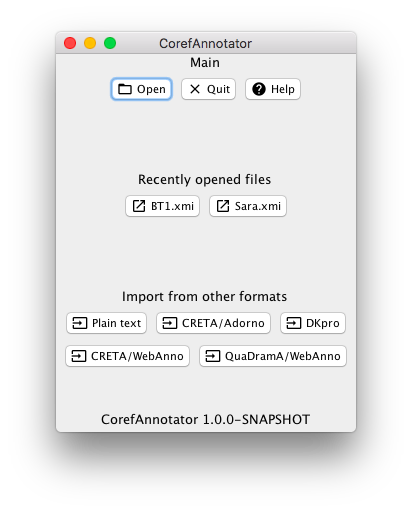
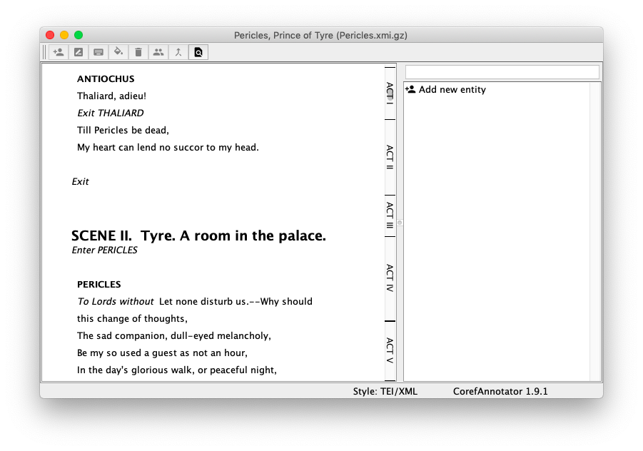

[](https://doi.org/10.5281/zenodo.1228106)
[](https://opensource.org/licenses/Apache-2.0)


[](https://travis-ci.org/nilsreiter/CorefAnnotator)
[](https://www.codefactor.io/repository/github/nilsreiter/corefannotator)
# Coref Annotator

This is an annotation tool for coreference. It's built on top of [Apache's UIMA](https://uima.apache.org), and works with long documents and long coreference chains.

## Features

- Supports annotation of long texts with many discourse entities
- Intuitive drag and drop operations
- Fully operable by keyboard for fast annotation
- Annotation texts can be formatted
- Search function to navigate in long texts
- Localisable in other languages (currently: English and German)
- Import and export in a few file formats
- Automatically generated candidates
- Search terms (including regular expressions) can be annotated en bloc


## Requirements

- Java 8 or higher; both Oracle Java and OpenJDK are supported.
- JavaFX: https://openjfx.io/openjfx-docs/#install-javafx
- [Oracle Java 8](https://www.oracle.com/technetwork/java/javase/downloads/jdk8-downloads-2133151.html) includes JavaFX;
  if you use OpenJDK or Oracle Java 11, you need to install JavaFX separately.

 
## How to cite
If you are using this annotation tool, it would be nice to cite this 
publication:

> Nils Reiter. **CorefAnnotator - A New Annotation Tool for Entity References**. In Abstracts of EADH: Data in the Digital Humanities, December 2018.
DOI: 10.18419/opus-10144

```bibtex
@inproceedings{ Reiter2018ag,
   Title = {{CorefAnnotator - A New Annotation Tool for Entity References}},
   Author = { Nils Reiter },
   Booktitle = {{Abstracts of EADH: Data in the Digital Humanities}},
   Location = { Galway, Ireland },
   Month = { December },
   Doi = { 10.18419/opus-10144 },
   Year = { 2018 }
}
```


## Screenshots

### Main Window



### Annotation Window





